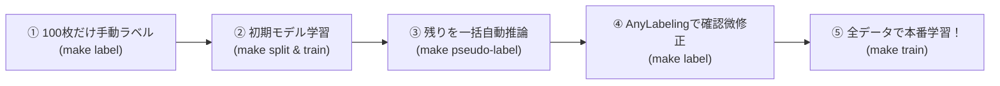

# aiformula_ws (ROS 2 Humble Development Environment)

Docker / Dev Container 上で動作する ROS 2 Humble の開発環境です。

## 概要

- **ROS 2 ディストリビューション**: ROS 2 Humble Hawksbill (Ubuntu 22.04 LTS)
- **コンテナ内ワークスペースパス**: `/aiformula_ws`
- **ユーザー**: `rosuser` (sudo 権限あり・パスワード不要)
- **対応アーキテクチャ**: Apple Silicon (arm64) / Intel & AMD (x86_64)
- **Web GUI (noVNC)**: ブラウザから RViz2 / rqt などの画面を表示可能 (`http://localhost:8080`)
- **📚 参考設計資料**: [AI Formula OIT 2026 システム詳細解説](file:///Users/miyanswer/aiformula_ws/docs/reference_ai_formula_oit_2026/README.md) (システム構成・トピック一覧・AI/制御ロジック等)

---

## 使い方

### 1. Dev Containers (VS Code / Antigravity IDE) で開く場合

1. VS Code / IDE でこのワークスペースフォルダを開きます。
2. 左下の緑色のアイコン、またはコマンドパレット (`Cmd + Shift + P`) から **「Dev Containers: Reopen in Container」** を選択します。
3. 自動的に Docker コンテナがビルド・起動し、コンテナ内環境に接続されます。

---

### 2. ターミナル (CLI / Docker Compose) から利用する場合

#### コンテナのビルド & 起動
```bash
# 初回ビルド (またはDockerfile変更時)
make build

# コンテナのバックグラウンド起動
make up
```

#### コンテナ内シェルへの接続
```bash
# 一般ユーザー (rosuser) として接続
make bash

# root ユーザーとして接続したい場合
make root-bash
```

#### コンテナの停止
```bash
make down
```

---

## 🖥️ Web GUI (RViz2 / rqt) の使い方

Mac のブラウザからコンテナの GUI アプリを表示できます。

1. **ブラウザで GUI 画面を開く**:
   ```bash
   make gui
   # またはブラウザで http://localhost:8080 にアクセス
   ```
2. **コンテナ内で GUI アプリを起動**:
   ```bash
   make bash
   rviz2   # RViz2 を起動
   # または
   rqt     # rqt を起動
   ```
3. ブラウザ上に RViz2 / rqt のウィンドウが表示され、Mac からマウスやキーボードで直接操作できます。

---

## コンテナ内での ROS 2 基本操作

コンテナ内に入ると自動的に `/opt/ros/humble/setup.bash` および `/aiformula_ws/install/setup.bash` が読み込まれます。

### 1. 動作確認 (talker / listener)
```bash
# ターミナル1: パブリッシャ起動
ros2 run demo_nodes_cpp talker

# ターミナル2 (別のシェルで make bash して実行): サブスクライバ起動
ros2 run demo_nodes_py listener
```

### 2. 新しいパッケージの作成
```bash
cd /aiformula_ws/src
ros2 pkg create --build-type ament_python my_python_package
# または
ros2 pkg create --build-type ament_cmake my_cpp_package
```

### 3. ワークスペースのビルド
```bash
cd /aiformula_ws
colcon build --symlink-install
source install/setup.bash
```

---

## ディレクトリ構成

```
aiformula_ws/
├── data/
│   └── tasks/
│       ├── jinmen_dog/              # 人面犬認識タスク
│       │   ├── raw_videos/          # 撮影動画 (.mp4, .mov 等)
│       │   ├── raw_images/          # 静止画像・スマホ写真 (.jpg, .png, .webp 等)
│       │   ├── extracted_frames/    # 抽出画像 & AnyLabeling .json / .txt
│       │   └── dataset/             # 分割済みYOLOデータ (data.yaml, train, val)
│       ├── traffic_light_red/       # 赤信号認識タスク
│       ├── traffic_light_green/     # 青信号認識タスク
│       ├── t_junction/              # T字路標示認識タスク
│       └── crosswalk/               # 横断歩道認識タスク
├── models/                          # 学習済みベストモデルの集約ディレクトリ
│   ├── jinmen_dog.pt                # 人面犬の学習済みモデル
│   ├── traffic_light_red.pt         # 赤信号の学習済みモデル (学習後)
│   ├── traffic_light_green.pt       # 青信号の学習済みモデル (学習後)
│   ├── t_junction.pt                # T字路標示の学習済みモデル (学習後)
│   └── crosswalk.pt                 # 横断歩道の学習済みモデル (学習後)
├── scripts/                         # YOLO 物体認識 & データセット用スクリプト集
│   ├── record_video.py              # Webカメラ FHD 15fps 録画ツール (--task 対応)
│   ├── extract_frames.py            # 動画切り出し & 静止画取り込みツール (EXIF自動回転対応)
│   ├── auto_annotate.py             # 1枚ラベリングから全自動アノテーション (--task 対応)
│   ├── split_dataset.py             # YOLOデータセット自動分割 & data.yaml 生成 (--task 対応)
│   ├── train_yolo.py                # YOLOv11 ファインチューニング学習 (--task 対応)
│   └── detect_webcam.py             # リアルタイムWebカメラ・静止画物体認識テスト (--task 対応)
├── Makefile                         # コマンドショートカット (TASK=... 対応)
├── requirements-yolo.txt            # YOLO パイプライン用 Python 依存関係
├── .gitignore
└── README.md
```

---

## 🎯 タスク別 YOLO 物体認識 学習パイプライン

赤信号（`traffic_light_red`）、青信号（`traffic_light_green`）、T字路（`t_junction`）、横断歩道（`crosswalk`）、人面犬（`jinmen_dog`）など、**タスク名（`TASK`）を指定するだけ**で、それぞれのデータセットとモデルを完全に分離して独立管理できます。

### 1. 依存ライブラリのインストール (初回のみ)

```bash
make yolo-install
```

---

### 2. データの準備（動画撮影 または 静止画・写真の配置）

#### パターンA: Webカメラで動画を撮影する場合
```bash
# 赤信号を撮影する場合
make record TASK=traffic_light_red

# 青信号を撮影する場合
make record TASK=traffic_light_green

# T字路標示を撮影する場合
make record TASK=t_junction
```
- **操作方法**: `[r]` で録画開始/停止、`[s]` でスクショ、`[q]` で終了。
- 動画は自動的に `data/tasks/<TASK>/raw_videos/` に保存されます。

#### パターンB: 静止画像・スマホ写真を追加する場合
- スマートフォンや一眼レフで撮影した写真、ダウンロードした画像（`.jpg`, `.jpeg`, `.png`, `.webp` 等）を `data/tasks/<TASK>/raw_images/` に配置します。

---

### 3. 動画からのフレーム切り出し & 静止画の取り込み

動画（`raw_videos`）と静止画（`raw_images`）を一括で処理し、アノテーション用画像として `extracted_frames/` に出力します。

```bash
# 赤信号のデータを取り込み
make extract TASK=traffic_light_red

# 青信号のデータを取り込み
make extract TASK=traffic_light_green

# T字路や横断歩道など、道路面を俯瞰 (Bird's Eye View / IPM) 視点に変換して取り込み
make extract-bev TASK=t_junction
```
- **道路面 BEV (俯瞰視点 / IPM) 変換**: `--bev` または `make extract-bev` を指定すると、車載カメラの透視投影歪みを補正し、真上から見下ろした俯瞰画像に自動変換して抽出します（ガンマ補正による明度最適化、バンパー映り込み除去、BEV動画生成にも対応）。
- **スマホ写真のEXIF回転自動補正**: 縦向き・横向き写真の向きを自動判定して正立させます。
- **フレーム名と既存データの保持**: 切り出されるファイル名には動画ファイル名が含まれる（`frame_<動画名>_<番号>.jpg` / `frame_bev_<動画名>_<番号>.jpg`）ため、**後から新しい動画を追加して extract しても、既存フレームや作成済みアノテーション（`.json` / `.txt`）が上書き・破損することはありません**。
- **新規動画をまとめて追加した場合の切り出し方法**:
  - **方法1 (一番簡単)**: `data/tasks/<TASK>/raw_videos/` に複数動画をそのまま放り込み、`make extract TASK=traffic_light_red` を実行（フォルダ内の全動画から自動抽出されます）。
  - **方法2 (既存動画の再走査をスキップしたい場合)**: 新規動画だけを一時フォルダ（例: `data/tasks/<TASK>/raw_videos/new_batch/` など）にまとめ、フォルダパスを指定:
    ```bash
    python3 scripts/extract_frames.py --task traffic_light_red --source data/tasks/traffic_light_red/raw_videos/new_batch
    ```
- 静止画像のみを取り込みたい場合は `make import-images TASK=traffic_light_red` も利用可能です。
- 任意の外部フォルダから直接取り込む場合:
  ```bash
  python3 scripts/extract_frames.py --source /path/to/my_photos --task traffic_light_red
  ```

---

### 4. アノテーション（ラベル付け）

#### ⚡ おすすめ: AnyLabeling (SAM 2 AIアシスト)
```bash
# 赤信号のアノテーション
make label TASK=traffic_light_red

# 青信号のアノテーション
make label TASK=traffic_light_green
```
1. 上部メニューの **「Auto-Labeling (AI)」** をONにし、**`Segment Anything 2 (Hiera-Tiny)`** を選択。
2. 物体（赤信号など）を **左クリック** するとAIが自動で綺麗に輪郭をハイライトします。
3. **`Space`** を押して確定し、クラス名（例: `red` または `green`）を入力。
4. **`D`** キーで次の画像へ進みます（自動保存されます）。

#### (参考) 1枚ラベリングからの全自動トラッキングアノテーション
```bash
make auto-annotate TASK=traffic_light_red
```

---

#### 🚀 大量画像の爆速アノテーション (Pseudo-Labeling サイクル)
「何百枚・何千枚もある画像をゼロから手動で囲む」のを防ぎ、**作業時間を70〜80%削減する王道ワークフロー**です。



1. **最初の100枚を手動で丁寧にアノテーション**:
   ```bash
   make label TASK=traffic_light_red
   ```
2. **100枚で初期モデル (v1) を学習**:
   ```bash
   make split TASK=traffic_light_red
   make train TASK=traffic_light_red
   ```
3. **残りの未アノテーション画像に初期モデルで一括自動ラベリング**:
   ```bash
   make pseudo-label TASK=traffic_light_red
   # 信頼度閾値の変更（見落としを減らしたい場合）:
   python3 scripts/pseudo_label.py --task traffic_light_red --conf 0.25
   ```
   - AnyLabeling 対応の `.json` と YOLO 形式の `.txt` が自動生成されます。
4. **AnyLabeling を開いて流すように確認・微修正 (Human-in-the-loop)**:
   ```bash
   make label TASK=traffic_light_red
   ```
   - 四角形がすでに配置されているため、**「ズレを直す」「不要な枠をDeleteキーで消す」だけで1枚1〜2秒**で完了します。
5. **修正が完了したら全データで本番モデル (v2) を再学習**:
   ```bash
   make split TASK=traffic_light_red
   make train TASK=traffic_light_red
   ```

---

#### 💡 過去に作った学習済みモデルで「新しく追加した動画・画像」を一括ラベリングする手順
既にモデル（`models/<TASK>.pt` や `runs/train/<TASK>/weights/best.pt`）が存在する場合、新しく追加したフレームに対して過去のモデルで自動ラベリングを行い、データセットを効率的に増やすことができます。

1. **新しい動画（複数本可）を追加してフレームを抽出**:
   ```bash
   # 新規動画が複数ある場合も一括でOK
   make extract TASK=traffic_light_red

   # ※ 特定の動画フォルダのみを指定したい場合:
   # python3 scripts/extract_frames.py --task traffic_light_red --source /path/to/new_videos_dir
   ```
2. **過去のモデルで自動ラベリングを実行**:
   ```bash
   # 自動で models/<TASK>.pt を読み込み、未アノテーションの画像のみを推論・ラベル付与
   make pseudo-label TASK=traffic_light_red

   # ※ 特定の過去モデル重みファイルを明示的に指定する場合:
   python3 scripts/pseudo_label.py --task traffic_light_red --model models/traffic_light_red.pt --conf 0.25
   ```
   > 📌 **安心仕様**: 既にアノテーション済みの画像は自動スキップされるため、**過去に付けたラベルが上書きされることはありません**。
3. **AnyLabeling で確認・微調整**:
   ```bash
   make label TASK=traffic_light_red
   ```
4. **データセット分割 & 再学習（モデルのアップデート）**:
   ```bash
   make split TASK=traffic_light_red
   make train TASK=traffic_light_red
   ```

---

### 5. データセットの分割 (Train / Val) & `data.yaml` 生成

AnyLabeling の `.json` や `.txt` を自動検出し、80%の訓練データと20%の検証データに自動分割します。

```bash
make split TASK=traffic_light_red
# または青信号
make split TASK=traffic_light_green
```
- 出力先: `data/tasks/<TASK>/dataset/` (`data.yaml`, `train/`, `val/`)

---

### 6. YOLO モデルの学習 (Fine-Tuning)

Apple Silicon GPU (`mps`) で高速に学習（約1〜2分）します。

```bash
make train TASK=traffic_light_red
# または青信号
make train TASK=traffic_light_green
```
- 学習が完了すると、最高精度のモデルが **`models/<TASK>.pt`**（例: `models/traffic_light_red.pt`）に自動保存・集約されます。

---

### 7. 学習済みモデルでリアルタイム Webカメラ認識テスト

```bash
# 赤信号モデルでテスト
make detect TASK=traffic_light_red

# 青信号モデルでテスト
make detect TASK=traffic_light_green

# 人面犬モデルでテスト
make detect TASK=jinmen_dog

# TASKを省略すると、作成済みモデル一覧から番号で選べます！
make detect
```

---

### 8. 学習済みモデルで動画ファイルの認識テスト

動画（.mp4等）を再生しながら、モデルの検出精度やバウンディングボックスの挙動をリアルタイムで確認できます。

```bash
# 対話的にモデルと動画を選択して再生
make detect-video

# 赤信号モデルで動画をテスト（動画一覧から番号選択）
make detect-video TASK=traffic_light_red

# 特定の動画ファイルを指定してテスト
make detect-video TASK=traffic_light_red VIDEO=mp4/20260824_124734.mp4

# 検出枠付きの推論結果をMP4動画として保存
make detect-video TASK=traffic_light_red SAVE=1
```

#### 🎮 動画再生中の便利な操作キー:
- **`[SPACE]`**: 一時停止 / 再生
- **`[d]` / `[→]`**: 1フレーム進む（コマ送り）
- **`[a]` / `[←]`**: 1フレーム戻る（コマ戻し）
- **`[f]` / `[r]`**: 5秒早送り / 5秒巻き戻し
- **`[+]` / `[-]`**: 信頼度閾値（Confidence）をリアルタイムで調整（±0.05）
- **`[s]`**: 現在の検出フレームをスクリーンショット保存
- **`[q]` / `[ESC]`**: 終了

---

## 🛣️ YOLOP 白線認識モデルの追加学習（Fine-Tuning）

`mp4/` 内の走行動画を使って、コースの白線検知モデル（`object_road_detector` 用）をさらに高精度化するパイプラインです。

### 1. 動画からデータセット抽出 & 初期ラベル生成
```bash
make prepare-yolop-data
# または特定動画のみ指定
python3 scripts/prepare_yolop_dataset.py --video-file mp4/shihou_video_2026_08_24_13_51_47.mp4
```
> `data/yolop_dataset/` 配下に画像（`images/`）と白線マスク（`lane_masks/`）が train/val に自動生成されます。

### 2. ファインチューニング（追加学習）を実行

#### 🔹 【通常学習】
```bash
make train-yolop
```

#### 🔹 【方法 A: 上部黒塗り学習（安全＆ノイズ完全カット）】
画像サイズ・アスペクト比は維持したまま、空や人物の上部領域（45%）をマスクして学習します。
```bash
# 既存マスク画像の上部45%を一括黒塗り
make mask-top

# 標準 30 エポック学習
make train-yolop-mask

# 🌟 【最高精度・安定化版 v2】ウォームアップ + バッチ8 + 50エポック (おすすめ 🔥)
make train-yolop-mask-v2
```

#### 🔹 【方法 B: 下半分クロップ学習（路面解像度2倍・高精度）】
道路面（下部55%）のみを切り出して 640x640 に引き伸ばして学習します。
```bash
# 下部領域データセットを作成
make crop-bottom

# shiho-v2 ベースで下部クロップ学習
make train-yolop-crop
```

#### 🔹 【方法 C: 癖のない公式 YOLOP からの新規クロップ学習 🔥】
過去のコースの癖がない「公式 BDD100K 事前学習重み（`models/pretrained/yolop_official.pth`）」をベースにし、純粋にクロップ路面（解像度2倍）を学習させます。
```bash
# 公式 YOLOP 重み × 下半分クロップ学習（おすすめ）
make train-official-crop

# 公式 YOLOP 重み × 上部マスク学習
make train-official-mask
```

> 💡 **データセットの読み込み仕様と仕組みについて:**
> - `make train-yolop-crop` や `make train-official-crop` は、`data/yolop_dataset/`（元画像 1920x1080）から読み込み、**プログラム実行時にメモリ上で下部55%を自動切り出しして 640x640 に引き伸ばして学習** します（オンザフライ処理）。
> - そのため、事前に `make crop-bottom` でファイルを作成していなくても、元データが1つあれば全手法がワンコマンドで学習可能です。
> - もし `make crop-bottom` で生成した `data/yolop_cropped_dataset/` フォルダを明示的に指定して学習したい場合は、以下のように実行できます：
>   ```bash
>   python3 scripts/train_lane_yolop.py --data-dir data/yolop_cropped_dataset --weights models/pretrained/yolop_official.pth --output-name yolop_official_crop
>   ```

#### 📋 各学習コマンドと生成されるモデル一覧:
| コマンド | ベース重み | 前処理方式・ハイパーパラメータ | 生成されるモデルファイル |
| :--- | :--- | :--- | :--- |
| `make train-yolop` | `shiho-v2` | 通常全体学習 (30ep, batch4) | `models/shiho_lane_finetuned_best.pth` |
| `make train-yolop-mask` | `shiho-v2` | 上部45%黒塗り (30ep, batch4) | `models/shiho_lane_mask_best.pth` (現在の最高精度: 66.1%) |
| `make train-yolop-mask-v2` | `shiho-v2` | **上部45%黒塗り + Warmup + batch8 + 50ep** | **`models/shiho_lane_mask_v2_best.pth`** (安定化新モデル 🔥) |
| `make train-yolop-crop` | `shiho-v2` | 下部55%クロップ拡大 (30ep, batch4) | `models/shiho_lane_crop_best.pth` |
| `make train-official-crop` | **公式 YOLOP** | 下部55%クロップ拡大 (30ep, batch4) | `models/yolop_official_crop_best.pth` |
| `make train-official-mask` | **公式 YOLOP** | 上部45%黒塗り (30ep, batch4) | `models/yolop_official_mask_best.pth` |

---

### 3. 学習済みモデルの動画デバッグ・推論テスト（おすすめ 🎮）

作成したモデルと `mp4/` 内の動画を選択し、画面上でリアルタイム再生・一時停止・コマ送りしながら白線認識精度をデバッグできます。

```bash
# 対話的にモデルと動画を番号選択してデバッグ起動
make debug-lane

# 特定のモデルと動画を直接指定して起動
make debug-lane WEIGHTS=models/shiho_lane_crop_best.pth VIDEO=mp4/shihou_video_2026_08_24_13_51_47.mp4

# 推論結果をMP4動画として jpeg/ フォルダに書き出し保存
make debug-lane WEIGHTS=models/shiho_lane_crop_best.pth VIDEO=mp4/shihou_video_2026_08_24_13_51_47.mp4 SAVE=1
```

#### 🕹️ 動画デバッグ中の操作キー:
| キー | 機能 |
| :--- | :--- |
| **`[SPACE]`** | 一時停止 / 再生 |
| **`[d]`** / **`[→]`** | 1フレーム進む（コマ送り） |
| **`[a]`** / **`[←]`** | 1フレーム戻る（コマ戻し） |
| **`[f]`** / **`[r]`** | 5秒早送り / 5秒巻き戻し |
| **`[m]`** | 白線オーバーレイ表示 ON / OFF 切り替え（元画像と比較） |
| **`[s]`** | 現在の検出フレームをスクリーンショット保存（`jpeg/` フォルダへ自動保存） |
| **`[q]`** / **`[ESC]`** | 終了 |

---

### 4. ROS 2（実機・Launch）での切り替え

`object_road_detector.yaml` または Launch 引数で簡単に切り替えられます：

- **方法 A (上部マスク)**: `roi_mode:=mask_top`
- **方法 B (下部クロップ)**: `roi_mode:=crop_bottom`
  *(※推論時は下部のみ拡大認識し、出力時に元画像 1920x1080 に自動で貼り戻すため、3D点群への幾何学変換は1mmも狂いません)*


