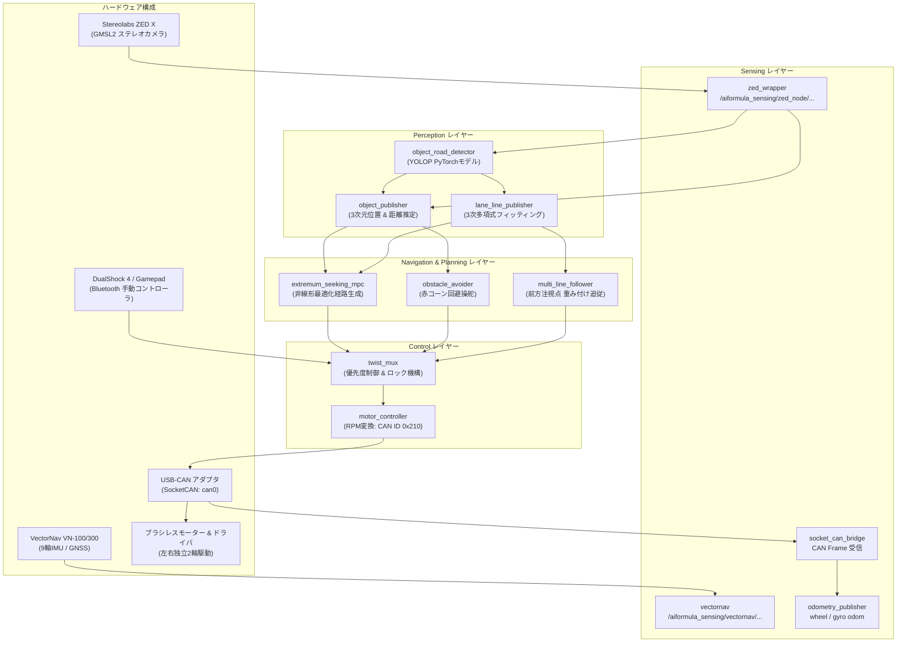

# 01. システム全体構成 & アーキテクチャ

## 1. システム全体像

`ai_formula_oit_2026` は、ステレオカメラ（ZED X）および IMU/GNSS、車輪エンコーダを統合し、深層学習ベースの走行可能領域・障害物認識と幾何学的な経路追従・回避制御を組み合わせて自律走行を行う ROS 2 パイプラインです。

---

## 2. レイヤー別詳細解説

### (1) センシング層 (Sensing Layer)
- **Stereolabs ZED X カメラ**:
  - GMSL2 接続の高信頼性ステレオカメラ。
  - 解像度: `nHD (960x540)` / `SVGA (960x600)` / `HD1080 (1920x1080)`
  - 左カメラ画像（歪み補正済み）、右カメラ画像、Depth画像、点群（PointCloud2）、内蔵IMUデータを高周波でパブリッシュ。
- **VectorNav VN-100 / VN-300**:
  - 高精度 9軸 IMU (加速度、角速度、地磁気) および GNSS 位置データ。
  - レーシングカーの高G旋回時でも安定した姿勢・ヨーレートを供給。
- **車輪エンコーダ (SocketCAN)**:
  - モータードライバから CAN ID `0x211` で左右輪の回転数（RPM）フィードバックを受信。
  - `odometry_publisher` で積分し、高精度なホイールオドメトリを生成。

---

### (2) 認識・AI層 (Perception Layer)
- **`object_road_detector`**:
  - 深層学習モデル **YOLOP (You Only Look at Once for Panoptic Driving Perception)** またはカスタマイズされた `shiho-v1 / shiho-v2` 重みを使用。
  - **Drivable Area (走行可能領域マスク)** と **Traffic Objects (障害物・コーンバウンディングボックス)** を同時に単一推論。
- **`lane_line_publisher`**:
  - 走行可能領域マスクのエッジから左白線・右白線・中央線を抽出。
  - カメラの内部・外部パラメータを用いて逆投影し、3D空間上の 3次多項式曲線（$y = ax^3 + bx^2 + cx + d$）としてフィッティング。
  - 結果を 3D点群（`sensor_msgs/msg/PointCloud2`）として出力。
- **`object_publisher`**:
  - 検出されたバウンディングボックスとステレオ点群を照合し、物体の 3次元位置（$X, Y, Z$）、幅、高さ、距離を算出。

---

### (3) ナビゲーション & 計画層 (Planning & Navigation Layer)
- **`multi_line_follower`**:
  - 左・右・中央の3系統のレーン点群（PointCloud2）を購読。
  - 自車前方（Lookahead距離: 0.0m 〜 10.0m）の点群に対し、遠方ほど重みを大きくする加重平均（Far Weight Gain）を適用して目標注視点を決定。
  - 目標点への偏差から P制御・PD制御で並進速度（$v$）と角速度（$\omega$）を算出。
- **`obstacle_avoider`**:
  - `object_publisher` から障害物（赤コーン等）の位置情報を受け取り、自車進行路上に障害物がある場合に回避方向へ追加の角速度オフセットを重畳。
- **`extremum_seeking_mpc`**:
  - 道路リスク関数（コースアウト確率）と障害物衝突リスク関数を最小化する極値探索型モデル予測制御。

---

### (4) 制御・駆動層 (Control Layer)
- **`twist_mux`**:
  - 複数の指令源（ゲームパッド手動、自動レーン追従、障害物回避、MPCなど）の優先順位を管理。
  - 緊急停止（E-Stop）や手動介入（オーバーライド）が発生した場合に即座に自律制御を遮断する安全設計。
- **`motor_controller`**:
  - 入力された `geometry_msgs/msg/Twist` ($v, \omega$) を、車両パラメータ（トレッド幅 $T$、車輪径 $D$、減速比 $G$）に基づいて左右輪の目標回転数 $RPM_{left}, RPM_{right}$ に変換。
  $$RPM_{left} = \frac{(v - \frac{\omega \cdot T}{2}) \times 60}{\pi \cdot D} \times G$$
  $$RPM_{right} = \frac{(v + \frac{\omega \cdot T}{2}) \times 60}{\pi \cdot D} \times G$$
  - CAN ID `0x210` の 8バイトデータ（右4バイト + 左4バイト）を生成し、SocketCAN（`can0`）へ送信。
