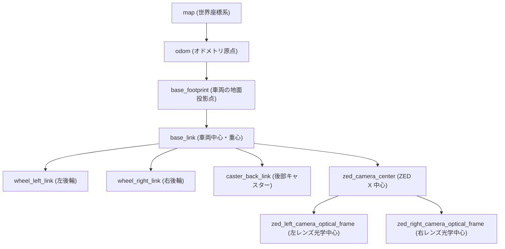

# 02. ROS 2 トピック & インターフェース一覧

本システム内でやり取りされる全 ROS 2 トピック、メッセージ型、フレームID（TF）、およびカスタムメッセージ定義です。

---

## 📡 1. トピック一覧テーブル (機能別)

### センシング系 (`/aiformula_sensing/...`)

| トピック名 | メッセージ型 | 送信元 (Publisher) | 受信元 (Subscriber) | 説明 |
| :--- | :--- | :--- | :--- | :--- |
| `/aiformula_sensing/zed_node/left_image/undistorted` | `sensor_msgs/msg/Image` | `zed_wrapper` | `object_road_detector`, `image_compressor` | 歪み補正済み 左カメラ画像 (RGB) |
| `/aiformula_sensing/zed_node/right_image/undistorted`| `sensor_msgs/msg/Image` | `zed_wrapper` | 認識ノード | 歪み補正済み 右カメラ画像 (RGB) |
| `/aiformula_sensing/zed_node/depth/depth_registered` | `sensor_msgs/msg/Image` | `zed_wrapper` | `object_publisher` | 距離深度画像 (Depth Map) |
| `/aiformula_sensing/zed_node/point_cloud/cloud_registered` | `sensor_msgs/msg/PointCloud2` | `zed_wrapper` | `lane_line_publisher`, `object_publisher` | 3次元カラー点群 |
| `/aiformula_sensing/zed_node/imu` | `sensor_msgs/msg/Imu` | `zed_wrapper` | `odometry_publisher` | ZED内蔵 6軸IMUデータ |
| `/aiformula_sensing/vectornav/imu` | `sensor_msgs/msg/Imu` | `vectornav` | `odometry_publisher` | VectorNav 9軸IMU (姿勢・角速度) |
| `/aiformula_sensing/vectornav/gnss` | `sensor_msgs/msg/NavSatFix`| `vectornav` | `odometry_publisher` | GNSS (GPS/GLONASS/QZSS) 位置 |
| `/aiformula_sensing/vehicle_info` | `can_msgs/msg/Frame` | `socket_can_bridge`| `motor_controller`, `odometry_publisher` | CAN受信フレーム (ID: `0x211` 車輪速FB) |
| `/aiformula_sensing/wheel_odometry_publisher/odom` | `nav_msgs/msg/Odometry` | `wheel_odometry_publisher` | ナビゲーション | 車輪エンコーダ積算オドメトリ |
| `/aiformula_sensing/gyro_odometry_publisher/odom` | `nav_msgs/msg/Odometry` | `gyro_odometry_publisher` | ナビゲーション | 車輪 + IMU統合オドメトリ |
| `/aiformula_sensing/rear_potentiometer/yaw` | `std_msgs/msg/Float32` | `rear_potentiometer` | 制御ノード | 後輪/ステアリング角度センサ値 |

---

### 認識系 (`/aiformula_perception/...`)

| トピック名 | メッセージ型 | 送信元 (Publisher) | 受信元 (Subscriber) | 説明 |
| :--- | :--- | :--- | :--- | :--- |
| `/aiformula_perception/object_road_detector/mask_image` | `sensor_msgs/msg/Image` | `object_road_detector` | `lane_line_publisher` | 走行可能領域のセグメンテーション2値マスク |
| `/aiformula_perception/object_road_detector/rect` | `vision_msgs/msg/Detection2DArray` | `object_road_detector` | `object_publisher` | コーンや障害物の2Dバウンディングボックス |
| `/aiformula_perception/lane_line_publisher/annotated_mask_image` | `sensor_msgs/msg/Image` | `lane_line_publisher` | RViz / 可視化 | 白線輪郭とフィッティング曲線の重畳マスク |
| `/aiformula_perception/lane_line_publisher/lane_lines/left` | `sensor_msgs/msg/PointCloud2` | `lane_line_publisher` | `multi_line_follower`, `mpc` | 左白線の3D点群 (3次曲線フィッティング) |
| `/aiformula_perception/lane_line_publisher/lane_lines/right` | `sensor_msgs/msg/PointCloud2` | `lane_line_publisher` | `multi_line_follower`, `mpc` | 右白線の3D点群 (3次曲線フィッティング) |
| `/aiformula_perception/lane_line_publisher/lane_lines/center` | `sensor_msgs/msg/PointCloud2` | `lane_line_publisher` | `multi_line_follower`, `mpc` | コース中央線の3D点群 (推奨走行軌跡) |
| `/aiformula_perception/object_publisher/object_info` | `aiformula_interfaces/msg/ObjectInfoMultiArray` | `object_publisher` | `obstacle_avoider`, `mpc` | 検出物体の3次元位置(X, Y, Z)、寸法、確信度 |

---

### 制御系 (`/aiformula_control/...`)

| トピック名 | メッセージ型 | 送信元 (Publisher) | 受信元 (Subscriber) | 説明 |
| :--- | :--- | :--- | :--- | :--- |
| `/aiformula_control/gamepad/joy` | `sensor_msgs/msg/Joy` | `gamepad_joy` | `gamepad_teleop` | ゲームパッド（DualShock4）の生入力 |
| `/aiformula_control/gamepad/cmd_vel` | `geometry_msgs/msg/Twist` | `gamepad_teleop` | `twist_mux` | 手動操縦時の速度・旋回指令 (最優先) |
| `/aiformula_control/lane_line_controller/cmd_vel` | `geometry_msgs/msg/Twist` | `multi_line_follower` | `obstacle_avoider`, `twist_mux` | 白線追従による自律走行指令 |
| `/aiformula_control/red_cone_controller/cmd_vel` | `geometry_msgs/msg/Twist` | `obstacle_avoider` | `twist_mux` | 障害物回避用の修正速度・旋回指令 |
| `/aiformula_control/extremum_seeking_mpc/cmd_vel` | `geometry_msgs/msg/Twist` | `extremum_seeking_mpc` | `twist_mux` | MPC最適化による自律走行指令 |
| `/aiformula_control/twist_mux/cmd_vel` | `geometry_msgs/msg/Twist` | `twist_mux` | `motor_controller` | **多重化・優先度判定後の最終速度指令** |
| `/aiformula_control/twist_mux/all/lock` | `std_msgs/msg/Bool` | 各種安全ノード | `twist_mux` | 非常停止 (E-Stop) 用ロック信号 |
| `/aiformula_control/motor_controller/reference_signal` | `can_msgs/msg/Frame` | `motor_controller` | `socket_can_bridge` | **モータードライバ送信 CAN (ID: `0x210`)** |

---

### 可視化・モニター系 (`/aiformula_visualization/...`)

| トピック名 | メッセージ型 | 送信元 (Publisher) | 説明 |
| :--- | :--- | :--- | :--- |
| `/aiformula_visualization/object_road_detector/annotated_image` | `sensor_msgs/msg/Image` | `object_road_detector` | 検出枠とマスクを描画したカメラ映像 |
| `/aiformula_visualization/zed/left_image/compressed` | `sensor_msgs/msg/CompressedImage` | `image_compressor` | 遠隔監視用のJPEG圧縮映像 |
| `/lane_target_marker` | `visualization_msgs/msg/Marker` | `multi_line_follower` | RViz表示用の目標注視点（Lookahead Point）マーカー |

---

## 🌳 2. TF (座標系変換) ツリー定義

車両の各コンポーネントの位置関係（キャリブレーション結果）は `sample_vehicle` の Xacro/URDF および `vehicle_tf_broadcaster` によって以下のように定義されています。



---

## 📄 3. カスタムメッセージ定義 (`oit_interfaces` / `aiformula_interfaces`)

### `ObjectInfo.msg` (単一障害物情報)
```protobuf
std_msgs/Header header
int32 id                 # クラスID (例: 0=Blue Cone, 1=Yellow Cone, 2=Red Cone)
string label             # クラス名 (例: "red_cone", "blue_cone")
float32 score            # 信頼度スコア (0.0 〜 1.0)
geometry_msgs/Point pos  # 3次元座標 (x: 前方距離[m], y: 左右距離[m], z: 高さ[m])
geometry_msgs/Vector3 size # 物体の寸法 (width, height, depth)
float32 distance         # 自車からのユークリッド距離 [m]
```

### `ObjectInfoMultiArray.msg` (障害物配列)
```protobuf
std_msgs/Header header
ObjectInfo[] objects     # 検出された全物体のリスト
```
