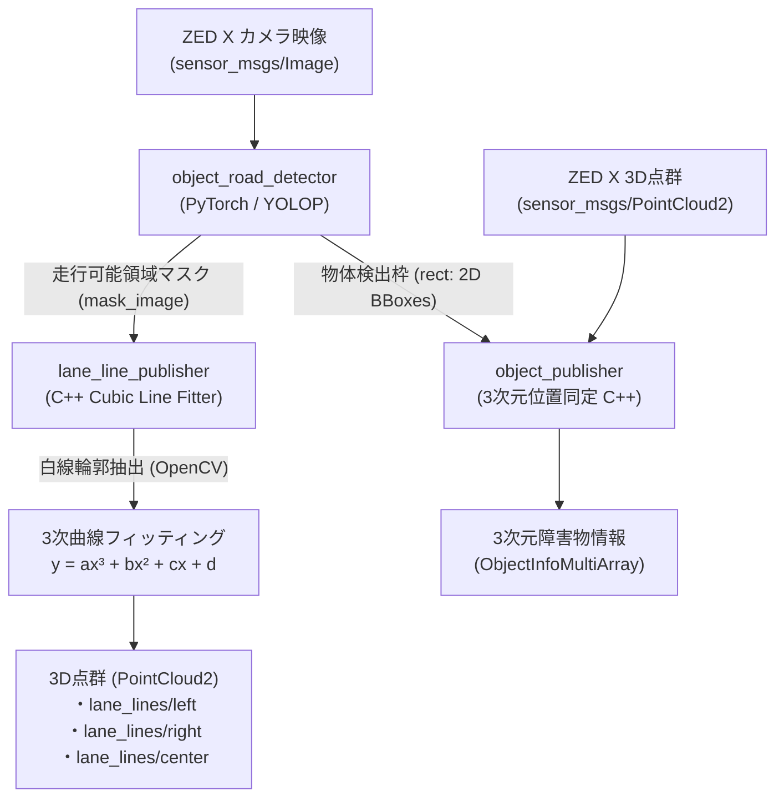

# 03. 認識 & AI パイプライン (Perception)

本リポジトリの認識系（`perception/`）は、**深層学習による全方位認識（YOLOP）** と **幾何学的画像処理・3次元フィッティング（C++）** を組み合わせて、リアルタイムにコースと障害物を高精度に同定する構成になっています。

---

## 🧠 1. `object_road_detector` (YOLOP 深層学習ノード)

### 概要
- `perception/object_road_detector/object_road_detector/object_road_detector.py`
- 高速なパノプティック認識モデル **YOLOP**（またはカスタマイズされた `weights/shiho-v1-20250321.pth` / `shiho-v2-20251118.pth`）を使用。
- NVIDIA GPU (CUDA) または Apple Silicon (MPS) を自動検知し、半精度浮動小数点（FP16）で高速推論。

### 出力
1. **走行可能領域マスク (`mask_image`)**:
   - 画像中の「走れるアスファルト面」を 255、それ以外を 0 とした単一チャンネル 2値画像。
2. **物体検出枠 (`rect`)**:
   - カラーコーン（青、黄、赤、オレンジ）の 2D バウンディングボックス配列。
3. **可視化重畳画像 (`annotated_image`)**:
   - カメラ映像の上にマスクを半透明（緑色）で重ね、検出枠を描画したモニター用映像。

---

## 📈 2. `lane_line_publisher` (3次曲線レーン生成ノード)

### 概要
- `perception/lane_line_publisher/src/lane_line_publisher.cpp`
- `object_road_detector` から受け取った走行可能領域マスクから、コース境界線（左白線・右白線）およびコース中心線を幾何学的に復元します。

### 処理アルゴリズムの流れ
1. **ピクセル探索 (`lane_pixel_finder.cpp`)**:
   - マスク画像の下端（車両直前）から上方向に向かってスキャンラインを引き、走行可能領域の「左端」と「右端」のエッジ座標（$(u, v)$）を抽出。
2. **カメラ座標系への逆投影**:
   - カメラの内部パラメータ行列 $K$ および地面に対する設置角度（ピッチ・ロール・地上高）を用いて、ピクセル座標 $(u, v)$ を車両座標系（$X$ [前方], $Y$ [左右], $Z=0$ [地面]）へ射影変換。
3. **3次多項式フィッティング (`cubic_line_fitter.cpp`)**:
   - 最小二乗法を用いて、抽出した点群を 3次多項式曲線に近似：
     $$y(x) = a \cdot x^3 + b \cdot x^2 + c \cdot x + d$$
   - 3次多項式を採用する理由：S字コーナーや複合コーナーの曲率変化を滑らかに表現できるため。
4. **コース中央線（Center Line）の合成**:
   - 左白線 $y_{left}(x)$ と 右白線 $y_{right}(x)$ の中点軌跡を計算：
     $$y_{center}(x) = \frac{y_{left}(x) + y_{right}(x)}{2}$$
   - 片側の白線が見失われた場合でも、規定のコース幅（例: 3.0m）を仮定して反対側を補完。
5. **PointCloud2 としてパブリッシュ**:
   - ナビゲーションノードが直接利用できるように、0.2m 間隔の点群データとして出力。

---

## 🎯 3. `object_publisher` (3次元物体位置同定ノード)

### 概要
- `perception/object_publisher/src/object_publisher.cpp`
- 2Dの物体検出枠（バウンディングボックス）と、ZED X の深度画像 / 点群（PointCloud2）を統合（Sensor Fusion）し、物体の正確な3次元位置を同定します。

### 処理の工夫
- **中央値フィルタによるノイズ除去**:
  - バウンディングボックス内の中心領域（ROIの50%）の点群をサンプリングし、外れ値を除去した中央値（Median Depth）から物体の中心座標 $(X, Y, Z)$ を決定。
- **フレームトラッキング**:
  - 前フレームの検出位置との距離を比較し、同一のコーンに ID を割り振って追跡（Tracked Object）。
- **出力**:
  - `aiformula_interfaces/msg/ObjectInfoMultiArray` 型で各障害物の $(X, Y, Z)$、相対距離、クラス名を出力。
