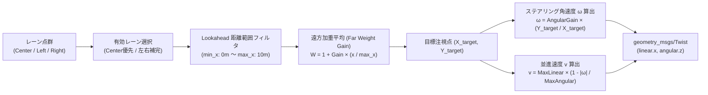
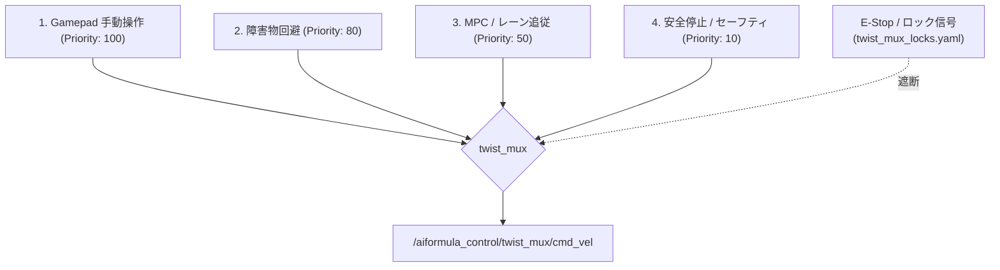

# 04. ナビゲーション & 制御ロジック (Navigation & Control)

本ドキュメントでは、認識結果（白線点群および障害物位置）から実際の車両駆動信号（CANフレーム）を生成するまでの制御パイプラインを解説します。

---

## 🧭 1. `multi_line_follower` (自律レーン追従制御)

### 概要
- `oit_navigation/oit_navigation/multi_line_follower.py`
- 3系統のレーン点群（`lane_lines/center`, `left`, `right`）を状況に応じて使い分け、滑らかにコースを高速追従するメインコントローラです。

### 制御アルゴリズム

#### ① レーン選択優先度
1. `center`（中央線）の点群が取得できている場合は最優先で使用。
2. `center` が途切れた場合、`left`（左白線）に +1.5m オフセット、または `right`（右白線）に -1.5m オフセットして仮想中心線を構築。
3. すべて見失った場合は直近の角速度を保ちつつフォールバックスピード（`fallback_speed: 0.5 m/s`）に減速。

#### ② 遠方加重平均 (Far-Weighted Lookahead Point)
単純な直近の点だけを追従すると蛇行（ハンチング）が発生しやすいため、遠方の点（$x \le 10.0\text{m}$）ほど重みを大きくして注視点を算出します：
$$Y_{target} = \frac{\sum (y_i \cdot w_i)}{\sum w_i}, \quad w_i = 1.0 + \text{far\_weight\_gain} \cdot \left(\frac{x_i}{\text{lookahead\_max\_x}}\right)$$

#### ③ 速度と旋回量の連動（コーナー減速）
直線では最高速度（`max_linear_speed: 2.0 m/s`）を出し、ステアリングを大きく切るヘアピンコーナー等では自動的に減速してスリップ・コースアウトを防止します。

---

## 🛑 2. `obstacle_avoider` (赤コーン障害物回避)

### 概要
- `oit_navigation/oit_navigation/obstacle_avoider.py`
- コース上に障害物（赤コーン等）が存在する場合、レーン追従指令に回避バイアス（オフセット旋回角速度）を重畳します。

### 回避ロジック
1. **危険エリア（ROI）の定義**:
   - 自車直前 $X \in [0.5\text{m}, 4.0\text{m}]$, 左右幅 $Y \in [-1.0\text{m}, 1.0\text{m}]$ 内の障害物を抽出。
2. **クラスタリング & 回避方向の判定**:
   - 障害物の中心座標が車体中心より「右」にある場合 $\rightarrow$ **左側** へ回避操舵（$+ \omega$）。
   - 障害物が「左」にある場合 $\rightarrow$ **右側** へ回避操舵（$- \omega$）。
3. **距離に応じた回避ゲイン**:
   - 接近するほど強い回避操舵を出力し、通過後はスムーズにレーン追従へ復帰。

---

## 🔀 3. `twist_mux` (速度指令 多重化 & 安全機構)

### 概要
- `control/twist_mux/src/twist_mux.cpp`
- 複数のノードから同時に出力される `geometry_msgs/Twist` の衝突を防ぎ、優先度順に 1つの最終コマンドにまとめます。

### 優先順位設定 (`twist_mux_topics.yaml`)

- **安全最優先設計**:
  - 人間がコントローラを動かした瞬間、自動運転は即座にオーバーライドされ手動操縦に切り替わります。
  - 非常停止スイッチ（E-Stop Lock）が ON になった場合、全出力を 0 に遮断します。

---

## ⚡ 4. `motor_controller` (CAN モーター制御ノード)

### 概要
- `control/motor_controller/motor_controller/motor_controller.py`
- ROS 2 の並進・角速度コマンド（`Twist`）を、物理的な差動2輪駆動（Differential Drive）のモーター目標回転数（RPM）へ変換し、CAN バス経由でモータードライバへ送信します。

### RPM変換式 (差動2輪キネマティクス)
- トレッド幅（左右タイヤ間距離）: $T = 0.52\,\text{m}$
- タイヤ直径: $D = 0.28\,\text{m}$
- ギヤ比: $G = 1.0$

$$\text{左車輪線速度: } v_L = v - \frac{\omega \cdot T}{2}$$
$$\text{右車輪線速度: } v_R = v + \frac{\omega \cdot T}{2}$$
$$RPM_L = \frac{v_L}{\pi \cdot D} \times 60 \times G$$
$$RPM_R = \frac{v_R}{\pi \cdot D} \times 60 \times G$$

### CAN 通信仕様
- **送信 CAN ID**: `0x210`
  - 送信周期: 20ms (50Hz)
  - データ長: 8 バイト
  - バイト 0〜3: 右輪目標 RPM (32bit 符号付きリトルエンディアン)
  - バイト 4〜7: 左輪目標 RPM (32bit 符号付きリトルエンディアン)
- **受信 CAN ID**: `0x211`
  - モータードライバからの車輪回転数（実測RPM）フィードバック。
