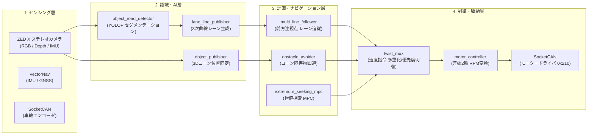

# AI Formula OIT 2026 リポジトリ解説 & システム設計書

本ドキュメントは、大阪工業大学（OIT）の AI Formula 2026 参戦用自律走行システムリポジトリ（[https://github.com/SEI2003/ai_formula_oit_2026](https://github.com/SEI2003/ai_formula_oit_2026)）のコードベース全体を詳細に分析し、システム構成、ROS 2 ノード、トピック、メッセージ型、自律走行・制御アルゴリズムをまとめた技術資料です。

---

## 📑 ドキュメント目次

| No | ドキュメント名 | 内容 |
| :--- | :--- | :--- |
| **01** | [システム全体構成 & アーキテクチャ](file:///Users/miyanswer/aiformula_ws/docs/reference_ai_formula_oit_2026/01_system_architecture.md) | システム全体アーキテクチャ図、ハードウェア構成、レイヤー別概要 |
| **02** | [ROS 2 トピック & インターフェース一覧](file:///Users/miyanswer/aiformula_ws/docs/reference_ai_formula_oit_2026/02_topic_and_interfaces.md) | パブリッシュ/サブスクライブされる全トピック名、型、TFツリー定義 |
| **03** | [認識 & AI パイプライン (Perception)](file:///Users/miyanswer/aiformula_ws/docs/reference_ai_formula_oit_2026/03_perception_and_ai.md) | YOLOP道路検出、レーン3次曲線フィッティング、3Dコーン検出 |
| **04** | [ナビゲーション & 制御ロジック (Navigation & Control)](file:///Users/miyanswer/aiformula_ws/docs/reference_ai_formula_oit_2026/04_navigation_and_control.md) | Multi-Line Follower、障害物回避、Twist Mux、CANモーター制御 |
| **05** | [起動手順 & Launchファイル構成](file:///Users/miyanswer/aiformula_ws/docs/reference_ai_formula_oit_2026/05_launch_and_operations.md) | `all_robot_nodes.launch.py`、CANセットアップ、rosbag記録手順 |

---

## 🏎️ リポジトリ概要

本システムは、**小型フォーミュラ車両（AI Car）による自律高速サーキット走行および障害物回避**を実現するための ROS 2 Humble ベースのソフトウェアスタックです。



---

## 📦 主要パッケージ一覧

```
ai_formula_oit_2026/
├── sensing/                    # センサー入力ドライバ群
│   ├── zed-ros2-wrapper        # ZED X ステレオカメラ (RGB/点群/オドメトリ)
│   ├── vectornav               # 高精度 IMU / GNSS
│   ├── odometry_publisher      # エンコーダ/ジャイロ オドメトリ統合
│   └── rear_potentiometer      # 操舵/後輪ポテンショメータ
├── perception/                 # 画像処理 & 深層学習認識
│   ├── object_road_detector    # YOLOP (PyTorch) 道路/コーン検出
│   ├── lane_line_publisher     # レーン輪郭抽出 & 3次スプライン点群生成
│   └── object_publisher        # 3D空間上の物体クラスタリング & 距離計測
├── planning/                   # 経路生成 & 最適化
│   └── extremum_seeking_mpc    # リスク関数に基づく極値探索モデル予測制御
├── oit_navigation/             # 自律走行メインロジック
│   ├── multi_line_follower.py  # 3系統レーン（左・中・右）追従走行
│   ├── obstacle_avoider.py     # 赤コーン検知による自律回避操舵
│   └── pid_feedback_controller # 各種PIDフィードバック制御
├── control/                    # 車両アクチュエーション
│   ├── twist_mux               # ジョイスティック/自動操縦の切り替え・安全ロック
│   └── motor_controller        # Twist(並進/旋回) -> 左右輪RPM変換 & CAN送信
├── launchers/                  # 統合起動スクリプト & 設定ファイル
│   └── sample_launchers        # all_robot_nodes.launch.py, CAN初期化等
└── vehicles/                   # 車両モデル & キャリブレーション
    └── sample_vehicle          # URDF / Xacro, TF, ZED X 内部/外部パラメータ
```
