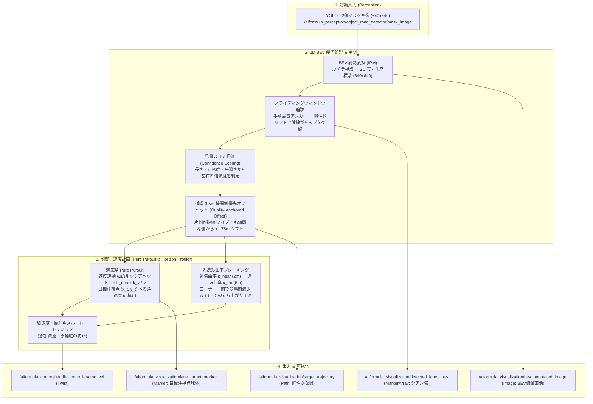

# ai_formula_oit_2027

AI Formula OIT 2027 向け **Vision-Only 2D BEV レーン追従・先読み Pure Pursuit 制御システム** パッケージです。

3D 点群（PointCloud2）や外部オドメトリに依存せず、**YOLOP の道路セグメンテーションマスクから直接 2D 鳥瞰図（BEV）変換、スライディングウィンドウ追跡、道幅 3.5m 綺麗側優先オフセット補間、先読みブレーキング、適応型 Pure Pursuit 操舵制御** をわずか 2〜4ms（超軽量・高応答）で実行します。

---

## 🏎️ システムアーキテクチャ



---

## 📡 入出力トピック一覧

### 入力トピック
| トピック名 | メッセージ型 | 説明 |
| :--- | :--- | :--- |
| `/aiformula_perception/object_road_detector/mask_image` | `sensor_msgs/msg/Image` | YOLOP による白線・道路セグメンテーションマスク画像 |

### 出力トピック
| トピック名 | メッセージ型 | 説明 |
| :--- | :--- | :--- |
| `/aiformula_control/handle_controller/cmd_vel` | `geometry_msgs/msg/Twist` | 車両への速度・操舵角速度指令 (twist_mux handle_controller入力) |
| `/aiformula_control/lane_tracker/status` | `std_msgs/msg/String` | 走行モード・指令速度・曲率ステータス文字列 |
| `/aiformula_visualization/detected_lane_lines` | `visualization_msgs/msg/MarkerArray` | 検出白線ラインストリップ（左: シアン, 右: イエロー） |
| `/aiformula_visualization/target_trajectory` | `nav_msgs/msg/Path` | 綺麗側から 1.75m オフセットされた目標走行ライン（鮮やかな緑） |
| `/aiformula_visualization/lane_target_marker` | `visualization_msgs/msg/Marker` | Pure Pursuit 目標注視点スフィア |
| `/aiformula_visualization/bev_annotated_image` | `sensor_msgs/msg/Image` | BEV 俯瞰認識オーバーレイ画像 |


---

## 🚀 使い方

### 1. ワークスペースのビルド
```bash
# コンテナ内 (/aiformula_ws) で実行
colcon build --packages-select ai_formula_oit_2027 --symlink-install
source install/setup.bash
```

### 2. 単体起動 (コントローラのみ起動)
```bash
ros2 launch ai_formula_oit_2027 controller.launch.py
```

### 3. 動画テスト統合起動 (MP4動画再生 + YOLOP + BEV制御 + RViz)
```bash
make test-control
```
*(※ブラウザで http://localhost:8080 を開くことで、RViz2 上でリアルタイム白線追従と緑の目標ラインが確認できます)*

---

## 🚦 信号機 垂直奥行き逆算 (Traffic Light Depth Estimation)

YOLO モデル (`models/traffic_light.pt`) を用いて信号機（赤/緑）を検出し、**バウンディングボックスの垂直高さ $h_{\text{px}}$ から直接、前方の垂直奥行き $Z$ [m] を幾何学的に逆算**します。

### 幾何計算モデル
角度（偏角や三角関数）の計算を行わず、ピンホールカメラの相似則により以下で求めます：

$$Z = \frac{f_y \times H_{\text{real}}}{h_{\text{px}}}$$

- $H_{\text{real}} = 0.32\text{ m}$ (1辺 32cm の正方形規格)
- $f_y = 2256.0\text{ px}$ (カメラ垂直焦点距離)
- $h_{\text{px}} = y_{\text{max}} - y_{\text{min}}$ (YOLO BBoxの高さ)

### 起動方法 (ROS 2)

#### 1. 信号機ノード単体起動 (既存のカメラトピックを受信)
```bash
ros2 launch ai_formula_oit_2027 traffic_light_detector.launch.py
```

#### 2. ZEDカメラと同時に1コマンドで起動 (実機運用時)
```bash
ros2 launch ai_formula_oit_2027 traffic_light_detector.launch.py launch_zed:=true camera_model:=zedx
```

#### 3. ZEDカメラ単体起動 (トピック自動リマップ付き)
```bash
ros2 launch ai_formula_oit_2027 zed_camera.launch.py camera_model:=zedx
```

### スタンドアロン動画検証 (ROS不要)
```bash
make detect-traffic-light VIDEO=mp4/shihou_video_2026_08_24_13_51_47.mp4
# または
python3 scripts/detect_traffic_light_depth.py --video mp4/shihou_video_2026_08_24_13_51_47.mp4
```


### 入出力トピック一覧
| 種別 | トピック名 | メッセージ型 | 説明 |
| :--- | :--- | :--- | :--- |
| **入力** | `/aiformula_sensing/zed_node/left_image/undistorted` | `sensor_msgs/msg/Image` | カメラの入力カラー画像 |
| **出力** | `/aiformula_perception/traffic_light/nearest_distance` | `std_msgs/msg/Float32` | 最近傍信号機の垂直奥行き $Z$ [m] |
| **出力** | `/aiformula_perception/traffic_light/red_distance` | `std_msgs/msg/Float32` | 最寄りの赤信号の垂直奥行き $Z$ [m] |
| **出力** | `/aiformula_perception/traffic_light/green_distance` | `std_msgs/msg/Float32` | 最寄りの緑信号の垂直奥行き $Z$ [m] |
| **出力** | `/aiformula_perception/traffic_light/debug_image` | `sensor_msgs/msg/Image` | BBox + クラス + 距離 $Z$ [m] 描画付き画像 |
| **出力** | `/aiformula_perception/traffic_light/status` | `std_msgs/msg/String` | 検出サマリー（JSON形式） |

