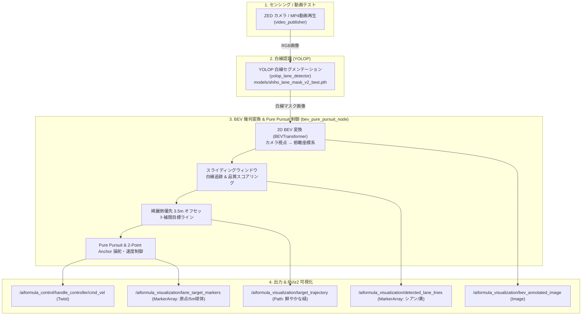

# oit_navigation

AI Formula OIT **Vision-Only 2D BEV レーン追従・YOLOP 白線認識・Pure Pursuit 制御システム** パッケージです。

3D 点群（PointCloud2）や外部オドメトリに依存せず、**YOLOP の学習済み重みモデルから白線マスクを推論し、2D 鳥瞰図（BEV）変換、スライディングウィンドウ白線追跡、道幅 3.5m 綺麗側優先オフセット補間、Pure Pursuit 経路追従制御、および RViz2 でのリアルタイム可視化** を実現します。

---

## 🏎️ システムアーキテクチャ



---

## 📡 入出力トピック一覧

### 入力トピック
| トピック名 | メッセージ型 | 説明 |
| :--- | :--- | :--- |
| `/aiformula_sensing/zed_node/left_image/undistorted` | `sensor_msgs/msg/Image` | カメラの入力カラー画像（または動画再生画像） |
| `/aiformula_perception/object_road_detector/mask_image` | `sensor_msgs/msg/Image` | YOLOP による白線セグメンテーションマスク画像 |

### 出力トピック
| トピック名 | メッセージ型 | 説明 |
| :--- | :--- | :--- |
| `/aiformula_control/handle_controller/cmd_vel` | `geometry_msgs/msg/Twist` | 車両への速度・操舵角速度指令 |
| `/aiformula_control/lane_tracker/status` | `std_msgs/msg/String` | 走行モード・指令速度・曲率ステータス |
| `/aiformula_visualization/detected_lane_lines` | `visualization_msgs/msg/MarkerArray` | 検出白線ラインストリップ（左: シアン, 右: イエロー） |
| `/aiformula_visualization/target_trajectory` | `nav_msgs/msg/Path` | 綺麗側から 1.75m オフセットされた目標走行ライン（鮮やかな緑） |
| `/aiformula_visualization/lane_target_markers` | `visualization_msgs/msg/MarkerArray` | 車両原点（0m）および前方注視点（5.0m）の目標球体マーカー |
| `/aiformula_visualization/bev_annotated_image` | `sensor_msgs/msg/Image` | BEV 俯瞰認識オーバーレイ画像 |
| `/aiformula_perception/object_road_detector/annotated_image` | `sensor_msgs/msg/Image` | カメラ視点での白線検出オーバーレイ画像 |

---

## 🚀 使い方

### 1. ワークスペースのビルド
```bash
# Docker コンテナ内 (/aiformula_ws) で実行
colcon build --packages-select oit_navigation --symlink-install
source install/setup.bash
```

### 2. PC 単体動画テスト起動 (動画再生 + YOLOP + BEV制御 + RViz2)
実機が手元になくても、MP4 動画を用いて全パイプラインを即座に検証できます。
```bash
ros2 launch oit_navigation video_test.launch.py use_device:=cpu
```
*(※ブラウザで http://localhost:8080 を開くことで、RViz2 上でリアルタイムに白線認識・緑の目標ライン・BEV俯瞰画像が確認できます)*

### 3. 実機 / 通常起動 (既存カメラトピックを受信)
```bash
ros2 launch oit_navigation navigation.launch.py use_device:=0
```
