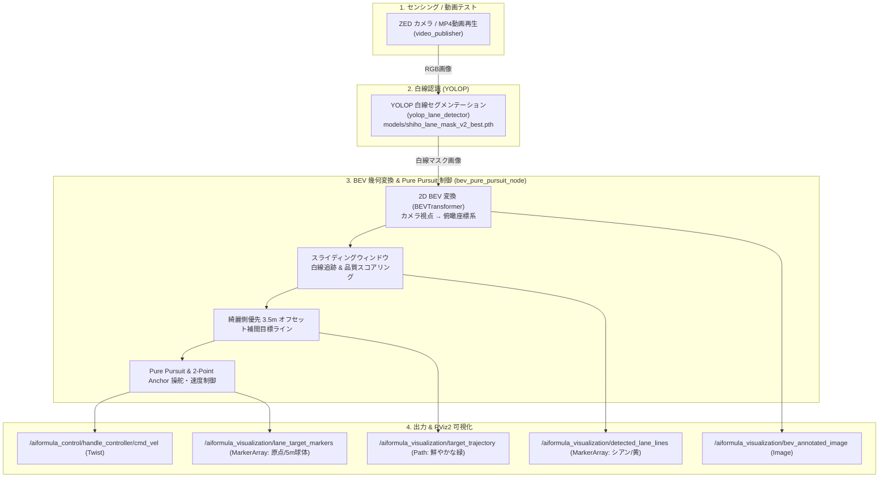

# oit_navigation

AI Formula OIT **Vision-Only 2D BEV レーン追従・YOLOP 白線認識・Pure Pursuit 制御システム** パッケージです。

3D 点群（PointCloud2）や外部オドメトリに依存せず、**YOLOP の学習済み重みモデルから白線マスクを推論し、2D 鳥瞰図（BEV）変換、スライディングウィンドウ白線追跡、道幅 3.5m 綺麗側優先オフセット補間、Pure Pursuit 経路追従制御、および RViz2 でのリアルタイム可視化** を実現します。

---

## 🏎️ システムアーキテクチャ



---

## 📡 入出力トピック一覧

### 入力トピック
| トピック名 | メッセージ型 | 説明 |
| :--- | :--- | :--- |
| `/aiformula_sensing/zed_node/left_image/undistorted` | `sensor_msgs/msg/Image` | カメラの入力カラー画像（または動画再生画像） |
| `/aiformula_perception/object_road_detector/mask_image` | `sensor_msgs/msg/Image` | YOLOP による白線セグメンテーションマスク画像 |

### 出力トピック
| トピック名 | メッセージ型 | 説明 |
| :--- | :--- | :--- |
| `/aiformula_control/handle_controller/cmd_vel` | `geometry_msgs/msg/Twist` | 車両への速度・操舵角速度指令 |
| `/aiformula_control/lane_tracker/status` | `std_msgs/msg/String` | 走行モード・指令速度・曲率ステータス |
| `/aiformula_visualization/detected_lane_lines` | `visualization_msgs/msg/MarkerArray` | 検出白線ラインストリップ（左: シアン, 右: イエロー） |
| `/aiformula_visualization/target_trajectory` | `nav_msgs/msg/Path` | 綺麗側から 1.75m オフセットされた目標走行ライン（鮮やかな緑） |
| `/aiformula_visualization/lane_target_markers` | `visualization_msgs/msg/MarkerArray` | 車両原点（0m）および前方注視点（5.0m）の目標球体マーカー |
| `/aiformula_visualization/bev_annotated_image` | `sensor_msgs/msg/Image` | BEV 俯瞰認識オーバーレイ画像 |
| `/aiformula_perception/object_road_detector/annotated_image` | `sensor_msgs/msg/Image` | カメラ視点での白線検出オーバーレイ画像 |

---

## 🚀 使い方

### 1. ワークスペースのビルド
```bash
# Docker コンテナ内 (/aiformula_ws) で実行
colcon build --packages-select oit_navigation --symlink-install
source install/setup.bash
```

### 2. PC 単体動画テスト起動 (動画再生 + YOLOP + BEV制御 + RViz2)
実機が手元になくても、MP4 動画を用いて全パイプラインを即座に検証できます。
```bash
ros2 launch oit_navigation video_test.launch.py use_device:=cpu
```
*(※ブラウザで http://localhost:8080 を開くことで、RViz2 上でリアルタイムに白線認識・緑の目標ライン・BEV俯瞰画像が確認できます)*

### 3. 実機 / 通常起動 (既存カメラトピックを受信)
```bash
ros2 launch oit_navigation navigation.launch.py use_device:=0
```

---

## 🚦 信号機距離推定 (traffic_light_distance_node)

`models/traffic_light.pt` (YOLO11n / クラス: `traffic_light_red`, `traffic_light_green`) で信号機を検出し、
**バウンディングボックスの縦の長さ = 画面に占める割合 (占有率)** から信号機までの距離 [m] を逆算して配信します。
信号機は **1 辺 32cm の正方形** を実寸として扱います (`real_height_m: 0.32`)。

このノードは `video_test.launch.py` に統合済みで、
`ros2 launch oit_navigation video_test.launch.py` を実行すると YOLOP レーン認識・BEV 制御と一緒に一括起動します
(`traffic_light:=false` で無効化)。単体起動は下記の専用 launch を使います。

### 距離の逆算式
```
occupancy = bbox_height_px / image_height_px
distance  = distance_coeff / occupancy
```
`distance_coeff` は次の優先順で決まります:

1. `distance_coeff` パラメータ (>0) — 既知距離で実測キャリブレーションした値を直接指定
2. `focal_length_y` [px] と `reference_image_height` [px] から
   `real_height_m * focal_length_y / reference_image_height`
3. `vertical_fov_deg` から `real_height_m / (2 * tan(vertical_fov_deg / 2))`

**カメラは ZED X** (2.2mm レンズ / AR0234, 画素ピッチ 3.0µm) を前提に、既定値は
`focal_length_y: 733.0` (= 2.2mm ÷ 3.0µm)、`reference_image_height: 1080` (HD1080) です。
より正確には `camera_info` トピックの `K[4]` (fy) を使ってください:
```bash
ros2 topic echo --once --field k /aiformula_sensing/zed_node/left_image/camera_info
```
グラブ解像度が **HD1200** なら `reference_image_height:=1200`、**SVGA (960×600)** なら
`focal_length_y:=367.0 reference_image_height:=600` に変更します
(焦点距離 [px] は解像度スケールに比例するため)。

### 入出力トピック
| 区分 | トピック名 | メッセージ型 | 説明 |
| :--- | :--- | :--- | :--- |
| 入力 | `/aiformula_sensing/zed_node/left_image/undistorted/compressed` | `sensor_msgs/msg/CompressedImage` (または `Image`) | カメラ入力画像 |
| 出力 | `/aiformula_perception/traffic_light/nearest_distance` | `std_msgs/msg/Float32` | 最も近い信号機までの距離 [m] |
| 出力 | `/aiformula_perception/traffic_light/red_distance` | `std_msgs/msg/Float32` | 最も近い赤信号までの距離 [m] |
| 出力 | `/aiformula_perception/traffic_light/green_distance` | `std_msgs/msg/Float32` | 最も近い青信号までの距離 [m] |
| 出力 | `/aiformula_perception/traffic_light/status` | `std_msgs/msg/String` | 検出内容の JSON (占有率・距離を含む) |
| 出力 | `/aiformula_perception/traffic_light/annotated_image` | `sensor_msgs/msg/Image` | 検出枠と推定距離のオーバーレイ画像 |

### 一括起動 (動画テスト)
```bash
colcon build --packages-select oit_navigation --symlink-install
source install/setup.bash

# 動画再生 + YOLOP + BEV制御 + 信号距離推定 + RViz2 をまとめて起動
ros2 launch oit_navigation video_test.launch.py use_device:=cpu

# 信号距離推定だけ切りたいとき
ros2 launch oit_navigation video_test.launch.py traffic_light:=false
```

### 単体起動 (実機 / 既存カメラトピック)
```bash
# 既定 (CPU / compressed カメラトピック)
ros2 launch oit_navigation traffic_light_distance.launch.py

# デバイスや入力トピックを指定
ros2 launch oit_navigation traffic_light_distance.launch.py device:=0 \
  image_topic:=/aiformula_sensing/zed_node/left_image/undistorted

# 単体ノード起動 + パラメータ調整 (例: camera_info の fy を指定)
ros2 run oit_navigation traffic_light_distance_node --ros-args \
  -p focal_length_y:=730.5 -p reference_image_height:=1080 -p real_height_m:=0.32

# 距離の確認
ros2 topic echo /aiformula_perception/traffic_light/nearest_distance
```

### 動画でのデバッグ (traffic_light_video_test.launch.py)
実機が無くても MP4 動画を流して検出・距離推定を確認できます。
`MP4 → video_publisher → カメラトピック(compressed) → traffic_light_distance_node → rviz2` の構成で起動します。

```bash
# 既定の動画で起動 (RViz2 に検出枠 + 推定距離を表示)
ros2 launch oit_navigation traffic_light_video_test.launch.py

# 動画・再生速度・デバイスを指定
ros2 launch oit_navigation traffic_light_video_test.launch.py \
  video_path:=/aiformula_ws/mp4/shihou_video_2026_08_24_15_08_28.mp4 \
  fps:=10.0 device:=mps

# RViz2 を出さずログ / トピックだけで確認したいとき
ros2 launch oit_navigation traffic_light_video_test.launch.py rviz:=false
ros2 topic echo /aiformula_perception/traffic_light/nearest_distance
ros2 topic echo /aiformula_perception/traffic_light/status   # 占有率と距離の内訳 JSON
```

`RViz2` (`config/traffic_light_rviz.rviz`) のウィンドウを閉じると launch 全体が停止します。
推定距離が実測と合わない場合は `focal_length_y` を `camera_info` の実値に合わせるか、
既知距離で撮った動画から `distance_coeff = 実距離 [m] × occupancy` を求めて
`-p distance_coeff:=<値>` で直接与えてください
(`status` トピックの `occupancy_ratio` が各検出の占有率です)。
※ スマホ等で撮った動画は ZED X と画角が異なるため、動画デバッグでは `distance_coeff` の実測指定が最も確実です。

パラメータ定義は `config/traffic_light_params.yaml` を参照してください。

---

## 🧪 動画検証用launch一覧

MP4動画を使ってパイプラインの各段階を個別に検証できる launch を用意しています。
いずれも `video_path:=` で対象の動画を切り替えられます。

| # | 検証内容 | launchファイル | 主なノード構成 |
| :--- | :--- | :--- | :--- |
| ① | **YOLO単体**: 信号機検出 (bbox・占有率・距離) を確認 | `traffic_light_video_test.launch.py` | `video_publisher` → `traffic_light_distance_node` → `rviz2`(`traffic_light_rviz.rviz`) |
| ② | **YOLOP単体**: 白線・走路セグメンテーションを確認 (制御ノードは動かさない) | `yolop_video_test.launch.py` | `video_publisher` → `yolop_lane_detector` → `rviz2`(`yolop_rviz.rviz`) |
| ③ | **YOLOP + Pure Pursuit**: 白線検出から目標経路生成までを確認 | `video_test.launch.py traffic_light:=false` | `video_publisher` → `yolop_lane_detector` → `bev_pure_pursuit_node` → `rviz2` |
| ④ | **統合**: YOLO(信号機) + YOLOP(白線) + Pure Pursuit(制御) を一括確認 | `video_test.launch.py`(既定 `traffic_light:=true`) | `video_publisher` → `yolop_lane_detector` → `bev_pure_pursuit_node` → `traffic_light_distance_node` → `rviz2` |

```bash
# ① YOLO単体 (信号機検出)
ros2 launch oit_navigation traffic_light_video_test.launch.py video_path:=/aiformula_ws/mp4/<動画名>.mp4

# ② YOLOP単体 (白線・走路認識)
ros2 launch oit_navigation yolop_video_test.launch.py video_path:=/aiformula_ws/mp4/<動画名>.mp4

# ③ YOLOP + Pure Pursuit (経路生成まで、信号機ノードは無効化)
ros2 launch oit_navigation video_test.launch.py video_path:=/aiformula_ws/mp4/<動画名>.mp4 traffic_light:=false

# ④ 統合 (既定設定。全ノードを起動)
ros2 launch oit_navigation video_test.launch.py video_path:=/aiformula_ws/mp4/<動画名>.mp4
```

### 検証用GUI (verification_gui)

上記4パターンと動画ファイルを選んで `ros2 launch` を起動/停止できるブラウザ製ツールです。
コンテナ内のXvfb/noVNC (RViz用 `:8080`) にはCJKフォントが無く、Tkinter等で描くと日本語が文字化けするため、
標準ライブラリのみの小さなHTTPサーバー (`:8090`) を起動し、**ホスト側の通常ブラウザ**で開く方式にしています。
noVNCの画面とは別の、独立したブラウザタブ/ウィンドウとして開きます。

初回のみ `compose.yaml` にポート `8090` を追加済みなので、コンテナが古い状態で起動中の場合は
一度再作成してください:
```bash
docker compose up -d --force-recreate
```

起動:
```bash
colcon build --packages-select oit_navigation --symlink-install
source install/setup.bash
ros2 run oit_navigation verification_gui
```
ターミナルに表示される `http://localhost:8090` を **ホストPCの**ブラウザで開きます。

- 「検証パイプライン」で①〜④を選択
- 「動画フォルダ」(既定 `/aiformula_ws/mp4`) から `.mp4` 一覧を自動読み込み、「検証動画」で選択
- デバイス (`cpu` / `mps` / `0`)・FPS・ループ再生を指定して「起動」
- ログ画面にリアルタイム表示 (1秒間隔でポーリング)、「停止」で `ros2 launch` プロセスにSIGINTを送って全ノードを終了
